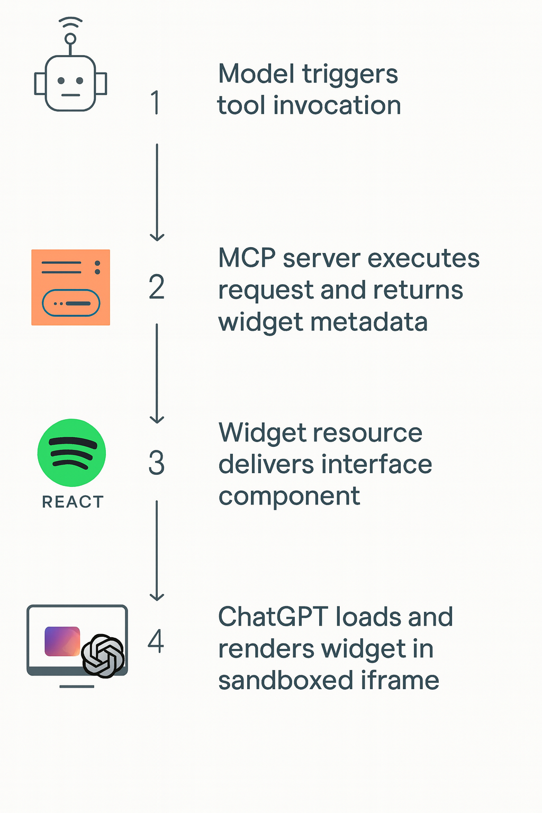

Written by [**Zach Park**](https://www.linkedin.com/in/zachhere/), Co-founder of Dooilabs

🕒 8 min read • 🔗 [Copy URL](https://docs.fastapps.dev/blog/inside-the-chatgpt-apps-sdk-how-it-actually-works) • Oct 23, 2025

The **OpenAI Apps SDK** introduces a way for developers to build rich, interactive experiences that live directly inside **ChatGPT**. These apps extend what users can do within a conversation, displaying information and tools, without ever breaking the natural flow of chat. Instead of sending users to an external website or separate interface, Apps in ChatGPT appear as integrated, lightweight components that maintain the platform's clarity and trusted conversational tone.

Every ChatGPT app is basically a **web component** that runs in a **sandboxed iframe** inside the conversation. This makes each app a "mini web app" hosted by ChatGPT itself. Developers can create interactive frontends that communicate with ChatGPT through the `window.openai` bridge. This bridge allows the app's UI to exchange data with the surrounding conversation and its corresponding **MCP server**, enabling the app to stay in sync with model responses and external data.

Now that we know what ChatGPT apps are, let's look under the hood to see how they actually work.

## Understanding MCP and Widgets in the OpenAI Apps SDK

Essentially, every Apps SDK app consists of two main parts: the **MCP server**, which hosts the tools, and the **web app views(widgets)**, which render interactive content for users.

The **Model Context Protocol(MCP)** forms the backbone of how the **OpenAI Apps SDK** connects models to external tools, data, and user interfaces. It defines an open standard for communication between language model clients and external systems, ensuring that the model, server, and UI remain perfectly synchronized. Through MCP, developers can expose custom tools that the model can invoke during a conversation, returning structured results enriched with metadata, such as inline HTML, to create dynamic, interactive widgets directly within the ChatGPT interface.

Widgets are the visual layer that bring your app to life inside ChatGPT. They are interactive web components, usually compiled React views, that are fetched from the MCP server and rendered directly within the chat interface. When a model calls a tool, the server can return not only structured data but also metadata that references a widget resource. The Apps SDK then loads this resource, typically inside an iFrame, to display content such as tables, forms, charts, or previews all inline with the model's responses.

Because MCP is transport-agnostic, it supports both Server-Sent Events and streaming HTTP. This flexibility allows the Apps SDK to deliver seamless, real-time app experiences that blend conversational logic with interactive UI components.

## High-level workflow

Under the hood, every ChatGPT app built with the OpenAI Apps SDK operates through a coordinated sequence of interactions between the model, the MCP server, and the widget interface. To illustrate, imagine a Spotify app where a user asks ChatGPT to "show my recently played songs on Spotify"



### Step 1: Model Triggers a Tool Invocation

The process begins when ChatGPT's model interprets the user's request and determines that it requires the Spotify app. The model issues a `call_tool` request to the app's MCP server, specifying the tool to execute(e.g., `getRecentTracks`) and any necessary parameters such as user authorization tokens or filtering options.

### Step 2: MCP Server Executes the Request and Returns Widget Metadata

The MCP server authenticates the user, queries Spotify's API for the relevant data, and constructs a structured response. Along with this data, it attaches metadata that references a widget resource: an identifier pointing to the UI component that should be rendered in ChatGPT.

### Step 3: Widget Resource Delivers the Compiled Interface Component

The widget resource hosts a precompiled web component, typically a React-based element, that defines the visual layout and interaction logic for the app. For example, it may include an interactive list of tracks with album artwork, song titles, and playback buttons. This resource is isolated so that ChatGPT can safely retrieve and render it.

### Step 4: ChatGPT Loads and Renders the Widget in a Sandboxed iFrame

Finally, ChatGPT fetches the widget and runs it inside a sandboxed iframe embedded within the conversation. Through the `window.openai` bridge, the widget communicates securely with ChatGPT and the MCP server, enabling real-time updates, data exchange, and user actions(like adding a song to a playlist or refreshing the feed) without leaving the chat.

Through these four stages, the Apps SDK coordinates model reasoning, tool execution, and UI rendering into one seamless pipeline.

With the widget now running inside ChatGPT, the next piece to understand is how it actually communicates.

## Understanding `window.openai`

In the Apps SDK, `window.openai` is the bridge that connects your app's frontend, the React widget running inside an iframe, to ChatGPT itself. It gives your component awareness of the ChatGPT environment, like the current theme, language, and display mode, while also providing live access to the app's data layer: inputs from the model, outputs from your server, and any persisted widget state. Through this shared surface, your component can stay synchronized with the conversation, react to layout or theme changes, and feel naturally embedded in ChatGPT rather than running as a detached web page.

Beyond being a passive data source, [`window.openai`](https://developers.openai.com/apps-sdk/build/custom-ux) also lets your widget act. It can invoke your MCP tools directly with `callTool`, send follow-up chat messages, open external links, or request a layout change(for example, expanding to fullscreen). The result is a true two-way bridge between the model, the user interface, and your backend, so every click, update, or message becomes part of a living conversation instead of a disconnected app session.

With this bridge in place, we can now look at how users actually encounter and interact with these apps inside ChatGPT.

## How Users Interact with Apps

### 1. Discovering Apps

[User interaction](https://developers.openai.com/apps-sdk/concepts/user-interaction) in the OpenAI Apps SDK starts with how ChatGPT recognizes or suggests the right app for the user's intent. Discovery happens in a few ways: through named mentions(e.g., "Spotify, show my workout playlist"), in-conversation discovery where the model analyzes chat history, tool metadata, brand mentions, and linking state, and external browsing via the app directory.

Inside the conversation, users can also launch apps directly from the "+" button, a high-intent entry point that ranks available apps based on current context. These pathways ensure apps appear naturally when they're relevant, keeping discovery effortless and contextual.

### 2. Using Apps in ChatGPT

When an app is selected, ChatGPT validates inputs, shows confirmation if needed, and renders the app inline within the chat. The interface inherits ChatGPT's theme and layout, maintaining consistency with the surrounding conversation.

The SDK encourages clear, action-oriented descriptions and concise metadata so the model can identify, confirm, and render tools smoothly.

### 3. Context and Continuity

Once linked, an app remains active in the model's context. ChatGPT considers previous results, user preferences, and conversation history to guide follow-up actions. Structured responses with stable identifiers allow users to refine or summarize earlier outputs, creating a sense of continuity without requiring persistent app state. The result is an experience that feels conversational yet functionally cohesive.

## Build ChatGPT Apps in Minutes

The OpenAI Apps SDK provides all the building blocks you need to create powerful, conversational applications inside ChatGPT, but you don't have to start from scratch.

**[FastApps](https://github.com/DooiLabs/FastApps)** streamlines the entire workflow so you can go from idea to running widget in under five minutes.

FastApps wraps the MCP server and Apps SDK widget scaffolding into a single, developer-friendly toolkit. It automatically sets up your project structure, connects your tools to ChatGPT, and handles the build pipeline for your React-based widgets, all with one command.

Here's how simple it is to begin:

```bash
pip install fastapps
fastapps init my-app
```

This creates a ready-to-run project with:

- **Server** – Preconfigured MCP server with tool auto-discovery
- **Widgets** – React components wired to `window.openai` out of the box
- **Build & Dev** – One-command build pipeline with live reload and ngrok tunnel

Once your app is initialized, just edit:

- `server/tools/my_widget_tool.py` – Define your logic and structured output
- `widgets/my-widget/index.jsx` – Design your UI and bind to tool data

Then build and run:

```bash
npm run build
fastapps dev
```

You'll get a public endpoint instantly shareable with ChatGPT or inspectable via MCPJam.

No manual config and no boilerplate.

## Final Thoughts

In many ways, this feels like a glimpse of the agentic internet taking shape where the Model Context Protocol serves as the connective tissue, the Apps SDK as its distribution platform, and ChatGPT users as the emerging marketplace. It's not just a new developer surface, but it's the early architecture of how intelligent agents, apps, and people will coexist in one continuous conversational ecosystem.

For more context on the broader vision of ChatGPT apps and their potential impact, check out our [exploration of what Apps in ChatGPT represent](https://www.fastapps.org/blog/what-are-apps-in-chatgpt-and-why-they-are-the-future-of-software) and why they're shaping the future of software.
