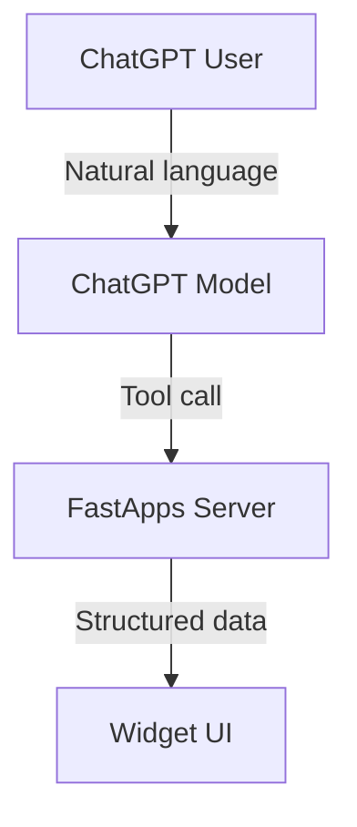

## How does ChatGPT apps work?
Your MCP server is the foundation of every ChatGPT App. It exposes tools that the model can call, enforces authentication, and packages the structured data plus component that the ChatGPT client renders inline. This guide walks through the core building blocks with examples in FastApps.

## Tool Architecture



## BaseWidget Class

Every FastApps tool must inherit from `BaseWidget`:

```python
class MyWidget(BaseWidget):
    # Required attributes
    identifier = "my_widget"           # Unique identifier
    title = "My Widget Title"          # Display name
    input_schema = MyInputModel        # Pydantic model
    invoking = "Setting up widget…"    # Progress message
    invoked = "Widget ready!"          # Completion message
    
    # Optional attributes
    description = "Widget description" # Help text
    widget_accessible = True           # Allow component calls
    
    def execute(self, inputs, ctx):
        # Your business logic here
        return {"data": "processed"}
```

## Next Steps

Ready to start building?

<CardGroup cols={3}>
  <Card title="Tool Basics" icon="book" href="/server/basics/index">
    Learn the fundamentals
  </Card>
  <Card title="API Integration" icon="plug" href="/server/integration/index">
    Connect to external services
  </Card>
  <Card title="Advanced Patterns" icon="wand-magic-sparkles" href="/server/advanced/index">
    Complex business logic
  </Card>
</CardGroup>

Or jump straight to the [**Quick Start Guide**](/quickstart/index) for a complete walkthrough.