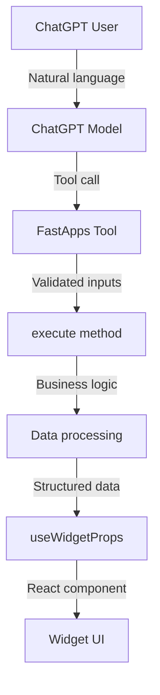

Learn how to create Python tools that power your ChatGPT widgets.

FastApps tools are Python classes that define the backend logic for your widgets. They handle input validation, business logic, and data preparation, then return structured data that your React components can display.

## Quick Start

The fastest way to create a tool:

```bash
fastapps create mytool
```

This creates:
- `server/tools/mytool_tool.py` - Python backend logic
- `widgets/mytool/index.jsx` - React frontend component

## Tool Architecture



## Core Concepts

### 1. **Input Validation**
- Pydantic models define input schemas
- Automatic validation and type checking
- Clear error messages for invalid inputs

### 2. **Business Logic**
- Implement your core functionality in `execute()`
- Access to FastApps context (logging, state, settings)
- Handle errors gracefully

### 3. **Data Flow**
- Tools return structured data
- Data flows to React components via `useWidgetProps()`
- Widget state persists across sessions

### 4. **MCP Integration**
- Automatic MCP tool registration
- ChatGPT understands when to call your tools
- Status messages for user feedback

## Learning Path

Choose your path based on your experience:

### 🚀 **Getting Started**
- [**Tool Basics**](/docs/tools/basics) - Learn the fundamentals
- [**Advanced Patterns**](/docs/tools/advanced) - Complex business logic
- [**API Integration**](/docs/tools/integration) - Connect to external services

### 📚 **By Topic**
- **Simple tools** → [Basics](/docs/tools/basics)
- **Complex logic** → [Advanced Patterns](/docs/tools/advanced)
- **External APIs** → [API Integration](/docs/tools/integration)
- **Full reference** → [API Reference](/docs/api-reference)

## Common Use Cases

| Use Case | Pattern | Example |
|----------|---------|---------|
| **Data Display** | Simple data transformation | Weather, news, statistics |
| **User Input** | Form processing, validation | Surveys, settings, preferences |
| **API Integration** | External service calls | Database queries, REST APIs |
| **File Processing** | Upload, analysis, conversion | Document parsing, image processing |
| **Real-time Data** | WebSocket, polling | Live updates, notifications |
| **Business Logic** | Complex calculations, workflows | Analytics, reporting, automation |

## Key Features

### ✅ **Type Safety**
Full Pydantic validation with clear error messages.

### ✅ **Automatic Registration**
Tools are auto-discovered and registered with ChatGPT.

### ✅ **Rich Context**
Access to logging, state management, and settings.

### ✅ **Error Handling**
Built-in error handling with graceful fallbacks.

### ✅ **Status Messages**
User-friendly progress indicators during execution.

### ✅ **Widget Integration**
Seamless data flow to React components.

## Example: Simple Calculator

```python
from fastapps import BaseWidget
from pydantic import BaseModel

class CalculatorInput(BaseModel):
    operation: str
    a: float
    b: float

class CalculatorWidget(BaseWidget):
    identifier = "calculator"
    title = "Calculator Widget"
    input_schema = CalculatorInput
    invoking = "Calculating…"
    invoked = "Calculation complete!"

    def execute(self, inputs: CalculatorInput, ctx):
        try:
            if inputs.operation == "add":
                result = inputs.a + inputs.b
            elif inputs.operation == "subtract":
                result = inputs.a - inputs.b
            elif inputs.operation == "multiply":
                result = inputs.a * inputs.b
            elif inputs.operation == "divide":
                if inputs.b == 0:
                    raise ValueError("Cannot divide by zero")
                result = inputs.a / inputs.b
            else:
                raise ValueError(f"Unknown operation: {inputs.operation}")
            
            return {
                "operation": inputs.operation,
                "a": inputs.a,
                "b": inputs.b,
                "result": result,
                "formula": f"{inputs.a} {inputs.operation} {inputs.b} = {result}"
            }
            
        except Exception as e:
            return {
                "error": str(e),
                "operation": inputs.operation,
                "a": inputs.a,
                "b": inputs.b
            }
```

## BaseWidget Class

Every FastApps tool must inherit from `BaseWidget`:

```python
class MyWidget(BaseWidget):
    # Required attributes
    identifier = "my_widget"           # Unique identifier
    title = "My Widget Title"          # Display name
    input_schema = MyInputModel        # Pydantic model
    invoking = "Setting up widget…"    # Progress message
    invoked = "Widget ready!"          # Completion message
    
    # Optional attributes
    description = "Widget description" # Help text
    widget_accessible = True           # Allow component calls
    
    def execute(self, inputs, ctx):
        # Your business logic here
        return {"data": "processed"}
```

## Learning Path

Ready to build your first tool? Follow this structured learning path:

### 1. **[Tool Basics](/docs/tools/basics)** - Fundamentals
Learn the core concepts of FastApps tools:
- What is a tool and how it works
- BaseWidget class and required attributes
- Input validation with Pydantic
- Basic patterns and error handling

### 2. **[Advanced Patterns](/docs/tools/advanced)** - Complex Logic
Build sophisticated tools with advanced features:
- Async operations and concurrent processing
- State management with FastApps context
- Database integration and file processing
- Caching and background tasks

### 3. **[API Integration](/docs/tools/integration)** - External Services
Connect your tools to external APIs and services:
- REST and GraphQL API integration
- Database connections (PostgreSQL, MongoDB)
- Third-party services (OpenAI, Stripe)
- Webhook handling and configuration management

## Quick Start

Want to jump right in? Use the FastApps CLI:

```bash
fastapps create mytool
```

This creates both the Python tool and React component for you to customize.

## Common Use Cases

| Use Case | Pattern | Example |
|----------|---------|---------|
| **Data Display** | Simple data transformation | Weather, news, statistics |
| **User Input** | Form processing, validation | Surveys, settings, preferences |
| **API Integration** | External service calls | Database queries, REST APIs |
| **File Processing** | Upload, analysis, conversion | Document parsing, image processing |
| **Real-time Data** | WebSocket, polling | Live updates, notifications |
| **Business Logic** | Complex calculations, workflows | Analytics, reporting, automation |

## Key Features

### ✅ **Type Safety**
Full Pydantic validation with clear error messages.

### ✅ **Automatic Registration**
Tools are auto-discovered and registered with ChatGPT.

### ✅ **Rich Context**
Access to logging, state management, and settings.

### ✅ **Error Handling**
Built-in error handling with graceful fallbacks.

### ✅ **Status Messages**
User-friendly progress indicators during execution.

### ✅ **Widget Integration**
Seamless data flow to React components.

## Architecture


## BaseWidget Structure

Every FastApps tool follows this pattern:

```python
from fastapps import BaseWidget
from pydantic import BaseModel

class MyInput(BaseModel):
    # Define your input schema
    pass

class MyWidget(BaseWidget):
    # Required attributes
    identifier = "my_widget"
    title = "My Widget Title"
    input_schema = MyInput
    invoking = "Setting up widget…"
    invoked = "Widget ready!"
    
    def execute(self, inputs: MyInput, ctx):
        # Your business logic here
        return {"data": "processed"}
```

## Next Steps

Ready to start building?

1. **[Tool Basics](/docs/tools/basics)** - Learn the fundamentals
2. **[Advanced Patterns](/docs/tools/advanced)** - Complex business logic
3. **[API Integration](/docs/tools/integration)** - Connect to external services

Or jump straight to the **[Quick Start Guide](/docs/quickstart)** for a complete walkthrough.