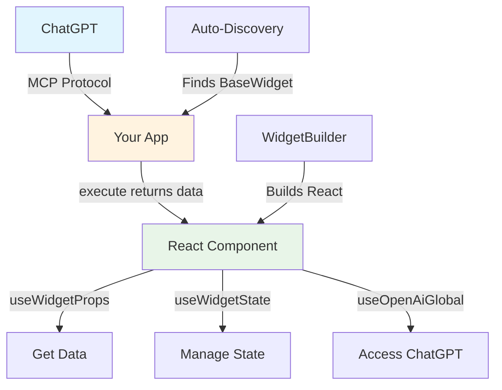

FastApps is the most effective and fast way to build Apps in ChatGPT, utilizing the FastMCP framework specialized for the apps sdk.

Here's a simple Hello World widget to show how easy it is:

**Python Backend** (`server/tools/hello_tool.py`)

```python
from fastapps import BaseWidget, Field
from pydantic import BaseModel

class HelloInput(BaseModel):
    name: str = Field(default="World", description="Name to greet")

class HelloTool(BaseWidget):
    identifier = "hello"
    title = "Hello Widget"
    input_schema = HelloInput
    
    async def execute(self, input_data: HelloInput):
        return {
            "message": f"Hello, {input_data.name}!",
            "emoji": "👋"
        }
```

**React Frontend** (`widgets/hello/index.jsx`)

```jsx
import React from 'react';
import { useWidgetProps } from 'fastapps';

export default function HelloWidget() {
  const props = useWidgetProps();
  
  return (
    <div>
      <h1>Hello world!</h1>
    </div>
  );
}
```

## Key Features

FastApps provides everything you need to build sophisticated ChatGPT apps:

**Widget Registration**: Use the `BaseWidget` class to simply register it as an MCP tool. We handle the rest - no complex configuration or manual registration needed.

**CLI commands**: Just type `fastapps init` to set up the whole project. Use `fastapps create mywidget` to make an widget. Everything from component creation to MCP tool registeration will be set up automatically.

**Simple auth**: Authentication and other advanced features are all handled with our simple decorators. Just add `@auth_required` and you're done.

## Solutions We Provide

FastApps solves the three biggest challenges in building ChatGPT apps:

**Complex setup**: Traditional approaches require extensive boilerplate, manual registration, and complex build systems. FastApps eliminates all of this with a simple two-file structure and automatic discovery.

**State management**: Managing persistent state across ChatGPT sessions is complex. We've transformed OpenAI's Apps SDK functions into a clean library. Simply import and use hooks like `useWidgetProps()`, `useWidgetState()`, and `useOpenAiGlobal()` without dealing with the raw SDK complexity.

**API integration**: Connecting to external APIs while handling security policies and data flow is challenging. FastApps handles CSP configuration and provides a clean data flow from Python to React.

## Getting Started

Ready to build your first widget? Follow our step-by-step guide:

1. **Install FastApps**: `pip install fastapps`
2. **Create a project**: `fastapps init my-app`
3. **Generate a widget**: `fastapps create my-widget`

Check out our [Getting Started Guide](/blog/tutorials/getting-started) for a complete walkthrough, or explore our [examples gallery](/docs/examples) to see real-world applications.

## Architecture



## What Makes FastApps Different?

Most frameworks force you to deal with:

- ❌ Complex project configuration
- ❌ Manual widget registration
- ❌ Boilerplate setup code
- ❌ Build system configuration

FastApps eliminates all of that:

- ✅ **Auto-discovery**: Widgets are automatically found and registered
- ✅ **Only two files per widget**: One Python file, one React file. That's it.
- ✅ **CLI scaffolding**: Generate widgets instantly
- ✅ **Type-safe**: Pydantic for Python, TypeScript for React
- ✅ **Apps SDK hooks support**: Use hooks like `useWidgetProps()` and `useWidgetState()`

## Next Steps

Now that you understand what FastApps is, explore these topics:

1. [**Introduction**](/docs/introduction) - Learn about the framework architecture
2. [**Quick Start**](/docs/quickstart) - Get up and running in minutes
3. [**Building Widgets**](/docs/widgets) - Create your first interactive component
4. [**Server**](/docs/server) - Develop Python backends for your widgets