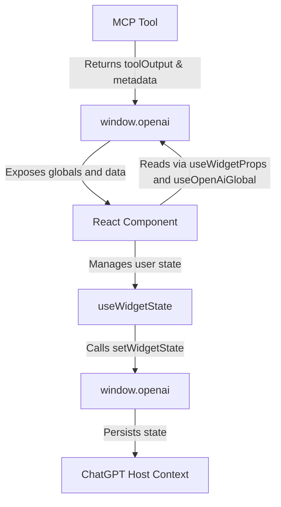

## Quick Start

The fastest way to create a widget:

```bash
fastapps create mywidget
```

This creates:

- `server/tools/mywidget_tool.py` - Python backend logic
- `widgets/mywidget/index.jsx` - React frontend component

## Widget Architecture



## Core Concepts

### 1. **Data Flow**

| **MCP Tool → window.openai**                      | The MCP tool returns toolOutput and metadata, which are stored inside window.openai.                                                       |
| :------------------------------------------------ | :----------------------------------------------------------------------------------------------------------------------------------------- |
| **window.openai → React Component**               | The component reads data (like tool input/output, theme, layout) from window.openai using hooks such as useWidgetProps or useOpenAiGlobal. |
| **React Component → useWidgetState**              | User interactions (clicks, filters, toggles) are handled in React and synchronized with the host through useWidgetState.                   |
| **useWidgetState → window.openai.setWidgetState** | When state changes, it’s sent to the host via window.openai.setWidgetState() for persistence.                                              |
| **window.openai → ChatGPT Host Context**          | ChatGPT stores the widget state persistently, so it’s available across sessions and visible to the model for reasoning.                    |

### 2. **File Structure**

```
widgets/
  mywidget/
    index.jsx          # React component
server/tools/
  mywidget_tool.py     # Python backend
```

### 3. **React Hooks**

- `useWidgetProps()` - Access tool output data
- `useWidgetState()` - Manage persistent state
- `useOpenAiGlobal()` - Access ChatGPT environment
- `useDisplayMode()` / `useMaxHeight()` - Layout convenience hooks

## Next Steps

Ready to start building?

<CardGroup cols={3}>
  <Card title="Widget Basics" icon="book" href="/widgets/basics/index">
    Learn the fundamentals
  </Card>
  <Card title="React Hooks" icon="code" href="/widgets/react-hooks/index">
    Master the hook system
  </Card>
  <Card title="Advanced Patterns" icon="wand-magic-sparkles" href="/widgets/advanced-patterns/index">
    Complex interactions
  </Card>
</CardGroup>