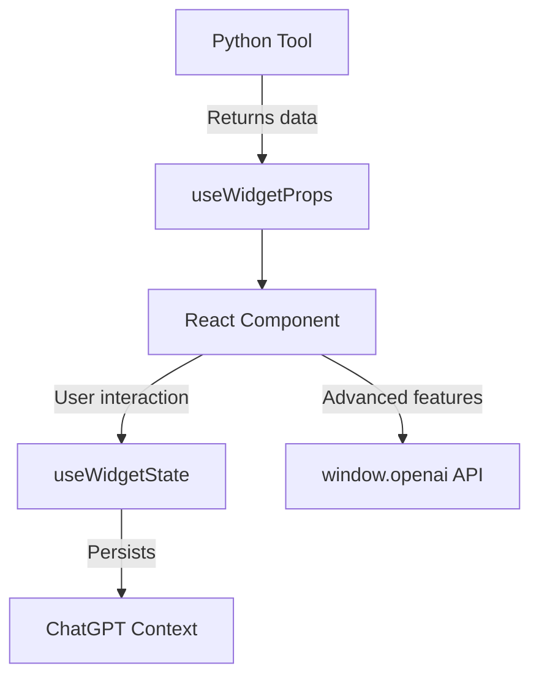

Learn how to create beautiful, interactive React components for your ChatGPT widgets.

FastApps widgets are React components that render inside ChatGPT and can interact with your Python backend tools. They provide a rich, interactive user experience that goes beyond simple text responses.

## Quick Start

The fastest way to create a widget:

```bash
fastapps create mywidget
```

This creates:
- `server/tools/mywidget_tool.py` - Python backend logic
- `widgets/mywidget/index.jsx` - React frontend component

## Widget Architecture



## Core Concepts

### 1. **Data Flow**
- Python tool returns data → `useWidgetProps()` → React component
- User interactions → `useWidgetState()` → Persistent across sessions

### 2. **File Structure**
```
widgets/
  mywidget/
    index.jsx          # React component
server/tools/
  mywidget_tool.py     # Python backend
```

### 3. **React Hooks**
- `useWidgetProps()` - Access tool output data
- `useWidgetState()` - Manage persistent state
- `useOpenAiGlobal()` - Access ChatGPT environment
- `useDisplayMode()` / `useMaxHeight()` - Layout convenience hooks

## Learning Path

Choose your path based on your experience:

### 🚀 **Getting Started**
- [**Widget Basics**](/docs/widgets/basics) - Learn the fundamentals
- [**React Hooks**](/docs/widgets/react-hooks) - Master the hook system
- [**Advanced Patterns**](/docs/widgets/advanced-patterns) - Complex interactions

### 📚 **By Topic**
- **Simple widgets** → [Basics](/docs/widgets/basics)
- **State management** → [React Hooks](/docs/widgets/react-hooks)
- **Tool integration** → [Advanced Patterns](/docs/widgets/advanced-patterns)
- **API reference** → [API Reference](/docs/api-reference)

## Common Use Cases

| Use Case | Pattern | Example |
|----------|---------|---------|
| **Data Display** | Lists, tables, cards | Product catalog, search results |
| **User Input** | Forms, toggles, sliders | Settings, filters, preferences |
| **Interactive Maps** | Embedded content | Location picker, route planner |
| **Real-time Data** | Auto-refresh, live updates | Stock prices, weather, notifications |
| **File Handling** | Upload, download, preview | Document viewer, image gallery |

## Key Features

### ✅ **Type Safety**
Full TypeScript support with auto-completion and validation.

### ✅ **Responsive Design**
Built-in support for different display modes (inline, pip, fullscreen).

### ✅ **Theme Support**
Automatic light/dark theme detection and styling.

### ✅ **Mobile Optimized**
Safe area handling and touch-friendly interactions.

### ✅ **Persistent State**
Widget state survives across ChatGPT sessions.

### ✅ **Direct API Access**
Call tools, send messages, request display changes.

## Example: Simple Counter

```jsx
import React from "react";
import { useWidgetState } from "fastapps";

export default function Counter() {
  const [count, setCount] = useWidgetState({ value: 0 });
  
  return (
    <div style={{ padding: "1rem", textAlign: "center" }}>
      <h2>Count: {count?.value || 0}</h2>
      <button onClick={() => setCount({ value: count.value + 1 })}>
        Increment
      </button>
    </div>
  );
}
```

## Learning Path

Ready to build your first widget? Follow this structured learning path:

### 1. **[Widget Basics](/docs/widgets/basics)** - Fundamentals
Learn the core concepts of FastApps widgets:
- What is a widget and how it works
- Basic widget structure and patterns
- Common UI patterns (lists, forms, conditional rendering)

### 2. **[React Hooks](/docs/widgets/react-hooks)** - Hook System
Master the React hooks that power widgets:
- `useWidgetProps()` - Access tool output data
- `useWidgetState()` - Manage persistent state
- `useOpenAiGlobal()` - Access ChatGPT environment
- `useDisplayMode()` / `useMaxHeight()` - Layout hooks

### 3. **[Advanced Patterns](/docs/widgets/advanced-patterns)** - Complex Interactions
Build sophisticated widgets with advanced features:
- Direct `window.openai` API usage
- Tool calling from components
- Display mode management
- External link handling

## Quick Start

Want to jump right in? Use the FastApps CLI:

```bash
fastapps create mywidget
```

This creates both the Python tool and React component for you to customize.

## Common Use Cases

| Use Case | Pattern | Example |
|----------|---------|---------|
| **Data Display** | Lists, tables, cards | Product catalog, search results |
| **User Input** | Forms, toggles, sliders | Settings, filters, preferences |
| **Interactive Maps** | Embedded content | Location picker, route planner |
| **Real-time Data** | Auto-refresh, live updates | Stock prices, weather, notifications |
| **File Handling** | Upload, download, preview | Document viewer, image gallery |

## Key Features

### ✅ **Type Safety**
Full TypeScript support with auto-completion and validation.

### ✅ **Responsive Design**
Built-in support for different display modes (inline, pip, fullscreen).

### ✅ **Theme Support**
Automatic light/dark theme detection and styling.

### ✅ **Mobile Optimized**
Safe area handling and touch-friendly interactions.

### ✅ **Persistent State**
Widget state survives across ChatGPT sessions.

### ✅ **Direct API Access**
Call tools, send messages, request display changes.

## Architecture


## Next Steps

Ready to start building?

1. **[Widget Basics](/docs/widgets/basics)** - Learn the fundamentals
2. **[React Hooks](/docs/widgets/react-hooks)** - Master the hook system  
3. **[Advanced Patterns](/docs/widgets/advanced-patterns)** - Build complex interactions

Or jump straight to the **[Quick Start Guide](/docs/quickstart)** for a complete walkthrough.
